# 0.前言

3、4月份的时候参加了DataFountain的情绪识别比赛，最终获得了B榜第46名的成绩。虽然不太理想，但还是想记录一下自己的参赛历程，学习一下前排大佬的解决方案，在这里分享一下，希望对大家能有所帮助。

# 1.赛题背景

2019新型冠状病毒（COVID-19）感染的肺炎疫情发生对人们生活生产的方方面面产生了重要影响，并引发国内舆论的广泛关注，众多网民参与疫情相关话题的讨论。为了帮助政府掌握真实社会舆论情况，科学高效地做好防控宣传和舆情引导工作，本赛题针对疫情相关话题开展网民情绪识别的任务。

# 2.赛题任务

给定微博ID和微博内容，设计算法对微博内容进行情绪识别，判断微博内容是积极的、消极的还是中性的。

# 3.数据简介与说明

数据集依据与“新冠肺炎”相关的230个主题关键词进行数据采集，抓取了2020年1月1日—2020年2月20日期间共计100万条微博数据，并对其中10万条数据进行人工标注，标注分为三类，分别为：1（积极），0（中性）和-1（消极）。

竞赛数据以csv格式进行存储，包括nCoV_100k.labled.csv和nCoV_900k.unlabled.csv两个文件，其中：

- nCoV_100k.labled.csv：包含10万条用户标注的微博数据，具体格式如下：[微博id,微博发布时间,发布人账号,微博中文内容,微博图片,微博视频,情感倾向]

1. 微博id，格式为整型。
2. 微博发布时间，格式为xx月xx日 xx:xx。
3. 发布人账号，格式为字符串。
4. 微博中文内容，格式为字符串。
5. 微博图片，格式为url超链接，[]代表不含图片。
6. 微博视频，格式为url超链接，[]代表不含视频。
7. 情感倾向,取值为{1,0,-1}。

- nCoV_900k.unlabled.csv为90万条未标注的微博数据，包含与“新冠肺炎”相关的90万条未标注的微博数据，具体格式如下：
  [微博id,微博发布时间,发布人账号,微博中文内容,微博图片,微博视频]
  1.微博id，格式为整型。
  2.微博发布时间，格式为xx月xx日 xx:xx。
  3.发布人账号，格式为字符串。
  4.微博中文内容，格式为字符串。
  5.微博图片，格式为url超链接，[]代表不含图片。
  6.微博视频，格式为url超链接，[]代表不含视频。

  **样例：**

| 微博id           | 微博发布时间   | 发布人账号 | 微博中文内容                                                 | 微博图片                                                     | 微博视频 | 情感倾向 |
| ---------------- | -------------- | ---------- | ------------------------------------------------------------ | ------------------------------------------------------------ | -------- | -------- |
| 4456072029125500 | 01月01日 23:50 | 存曦1988   | 写在年末冬初孩子流感的第五天，我们仍然没有忘记热情拥抱这2020年的第一天。带着一丝迷信，早晨给孩子穿上红色的羽绒服羽绒裤，祈祷新的一年，孩子们身体康健。仍然会有一丝焦虑，焦虑我的孩子为什么会过早的懂事，从两岁多开始关注我的情绪，会深沉地说：妈妈，你终于笑了！这句话像刀子一样扎入我?展开全文c | ['https://ww2.sinaimg.cn/orj360/005VnA1zly1gahhwworn5j30m80fyq4n.jpg'] | []       | 0        |
| 4456074167480980 | 01月01日 23:58 | LunaKrys   | 开年大模型…累到以为自己发烧了腰疼膝盖疼腿疼胳膊疼脖子疼#Luna的Krystallife#? | []                                                           | []       | -1       |

# 4.数据预处理

1. 非法字符去除及中英文符号的统一

   ```python
   import re
   r1 = "[a-zA-Z'!【】『』\"#$%&'()*+,-./:;<=>?@★[\\]^_`{|}~]+"
   comment = []
   for com_str in df['微博中文内容']:
       com_str = re.sub(r1,'',com_str) # 非法字符替换为空
       com_str = com_str.replace("展开全文",'')
       com_str = com_str.replace(',','，')
       com_str = com_str.replace('.','。')
       com_str = com_str.replace('?','？')
       com_str = com_str.replace(':','：')
       com_str = com_str.replace(';','；')
       com_str = com_str.replace('!','！')
       com_str = com_str.replace('"','\'')
       com_str = com_str.replace('’','\'')
       com_str = com_str.replace('‘','\'')
       if not com_str:
           com_str = '无'
       comment.append(com_str)
       
   df['微博中文内容'] = comment
   ```

   

2. 非法标签统计及去除

   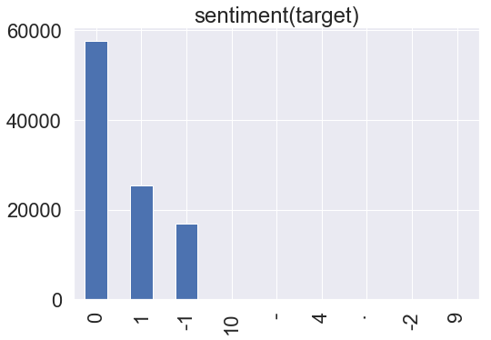

3. 重复数据的去除

4. 清洗后的句长统计

   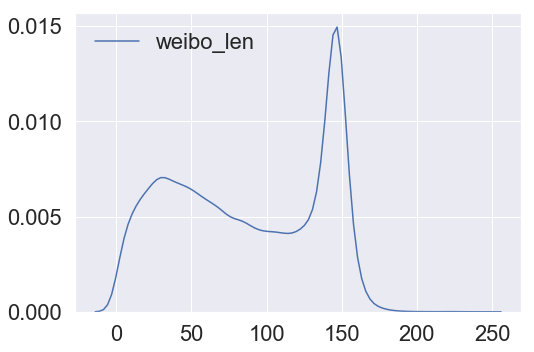

# 5.方法介绍

1. 句子长度选取

   由上图分析可知，句子长度绝大多数都在200以内，max_len设置为192。

2. 模型尝试

   尝试过bert-base和bert-wwm和roberta-wwm，roberta-wwm全词mask单模型预测得分最高。(roberta-wwm-large因为模型太大，而且句子长度较长，机器跑不动故放弃使用)。

3. 交叉验证

   以上三个模型分别在有标签的数据上采用5折交叉验证的方式训练，每个fold分别对测试集预测最后结果取平均。将3个模型得到的测试集结果分别提交，得分在0.72~0.73之间。

4. drouout选取

   为了防止模型过拟合，对bert的最后一次输出进行dropout。尝试过0.1，0.15，0.2，0.25，0.3，发现取0.25或0.2的时候效果较好。

5. F1指标优化（[来自包大人公众号文章](https://mp.weixin.qq.com/s?__biz=MzIwNDY1NTU5Mg==&mid=2247483862&idx=1&sn=a46c20770e430bc9c8271359cf6a6959&chksm=973d9f51a04a1647bd56a5e48c3f3af0591ab09ba86682a25aa313d6a7b11a76b0f9b1db3696&mpshare=1&scene=23&srcid=0905GDz0O6Pe4CJ72b3Kp6z9&sharer_sharetime=1599309420228&sharer_shareid=284a33e15e8fc7d85fe6fb1db3d7601a#rd)）

   [代码实现](https://www.jianshu.com/p/51debab91824)

   > 多分类问题下面，我们经常会遇到一些指标，**比如正在进行的DF平台上的比赛，疫情期间网民情绪识别，用这个trick就能轻易地从0.726提升到0.738**。
   >
   > 简单地说就是如果多类别不均衡的话，这时候直接使用神经网络优化交叉熵损失得到的结果，f1显然不是全局最优的，**很多同学都会问，二分类下的阈值搜索我会，如果是多分类怎么做一个阈值搜索呢？**传统的多分类我们预测结果使用argmax(logits)这时候，可以形式化的表达为求argmax(w*logits)使得f1均值最大。其中w就是要求得的再放缩权重。 我们可以使用非线性优化的方法，求解这个问题，scipy的库里有很多实现了。
   >
   > **再比如正在进行的Kaggle平台上的Bengali手写体识别比赛，使用这个技巧在线上可以有一定的提升，其指标是macro_recall。**

6. 模型融合

   尝试过投票和加权融合，最后采取加权融合的方式。依据单个模型在测试集上的得分分配权重。

   | 模型        | 权重 |
   | ----------- | ---- |
   | bert-base   | 0.2  |
   | bert-wwm    | 0.3  |
   | roberta-wwm | 0.5  |


最终B榜成绩0.73851329。

# 6.使用的其他trick，但不work

1. 采用对抗训练的思想，使用FGM/PGD对embedding层进行扰动，提高模型的鲁棒性。

   训练速度变慢了，但结果变低了。

2. 因为有90k无监督数据，采用半监督的思想，用roberta-wwm模型对90k无标签训练数据预测，并选取预测置信度高的数据作为新的训练数据，与原有数据一起训练。

   结果没有提高，可能是因为选取的都是分类置信度高的数据，并没有给模型带来“新特征”，所以预测结果不好。这里并没有把这90k无标签的数据全部拿来训练，因为真的训练不动。。。

3. 用百度翻译api接口，将中文翻译成英文，再翻译回中文，作为数据增强。用增强后的数据单独训练，结果只有0.68+，增强后的数据和原有数据一起训练，结果0.71+，结果均下降。

4. bert最后一层连接2层gru再进行分类。

   训练变慢，结果变差。


# 7.前排大佬解决方案

# 一、A榜第二B榜第一方案

https://discussion.datafountain.cn/questions/2630

## 1.数据处理

1. 我们把数据编码转换为utf-8，把所有英文标点符号转换为中文标点符号，繁体转换为简体。把数据划分为5折。
2. 使用训练集、测试集和90万条语料训练GloVe词向量，在分词阶段把发现的新词和获取的微博话题加入到词典中，我们认为在新出现的热点事件中会出现一些高频新词，我们把这些新词挖掘出来能够对分词结果进行优化，在后续的词向量训练中也能够有所帮助，同时很多微博话题本身带有一定的情感色彩，而且网民常常通过热点话题标签来表达情感，如果把微博话题分词之后效果不如整个话题包含的情感信息丰富。
3. 我们还尝试对文本进行清洗和使用伪标签，效果不佳，但是为了在融合阶段确保模型的多样性最终并未舍弃其中的一些使用文本清洗数据和伪标签数据训练得到的结果。

## 2.模型改进

通过对BERT[1]系列模型和Roberta[2]系列模型以及ERNIE[3]模型的效果进行对比分析并考虑到时间成本等我们最终选择了Roberta_wwm_large_ext和bert_wwm_ext两个模型作为基础模型进行改造。

基于BERT类模型进行结构改造，具体包括如下几种改进方法:

1.将BERT类模型的pooler_out接入双向GRU或双向LSTM后再分类，如图4。

2将BERT类模型的输出接入双向GRU或双向LSTM后再分类，如图5。

3.将BERT类模型的输出接入双向LSTM后再接入双向GRU，对输出结果进行平均池化和最大池化再与BERT类模型的pooler_out进行拼接后再分类,如图6。

4.取BERT类模型的最后两层的第—状态位和pooler_out进行拼接以获取更多的句意信息，如图7。

5.将BERT类模型的输出字向量与词向量拼接后接入卷积层，再进行最大池化和平均池化，如图8，通过把词向量和字向量拼接的方式能够学习到新热点事件中出现的一些新词汇所包含的信息，同时向量信息也更加丰富。

6.将BERT类模型的输出字向量与词向量拼接双向LSTM后再接入双向GRU后接入卷积层，再进行最大池化和平均池化，如图9。

 

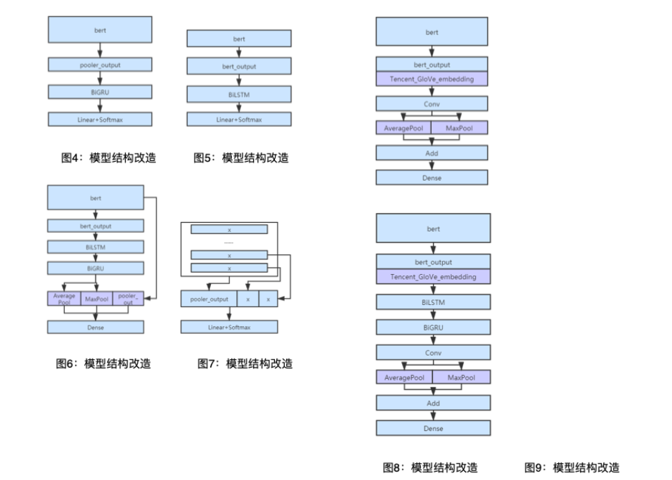

除了对模型结构进行改进之外，我们还使用90万条未标注语料对bert_wwm_ext模型进行再训练使模型能够学习到更多新热点事件中出现的新的文本信息，机器有限未能对Roberta模型进行再训练，如果可以应该能获得更好的效果。

## 3.调参及后处理

1. 在对文本长度进行分析的过程中我们发现文本长度集中分布在140左右，因此在最初训练的时候选择把max_sequence_length设置为140，在后续实验中通过对测试集中多模型预测不一致的数据观察发现很多微博内容存在先抑后扬的情况，因此把这一参数调到256确保能够把所有微博文本内容全部输入，避免结尾被截断导致错误的预测结果，最终获得一定的提升。
2. 在对Bert模型进行优化时，参考了[4]论文提出的对Bert模型的优化方法，我们尝试了discriminative fine-tuning层间学习率下降及Gradual unfreezing逐渐解冻的方法。其中层间学习率下降使用0.95的下降率，使得模型底层的学习率较低，有效地学习到通用信息，而越接近上层的学习率逐渐升高，可以更好地适应下游的具体任务，该方法获得明显提升。
3. 在数据分析阶段我们发现标签分布不平衡，针对这一问题我们尝试过对loss进行优化、改变样本权重和针对f1指标优化搜索标签类别权重等几种方法，最终采取针**对****f1****指标优化的方法**获得明显提升。

## 4.多轮投票融合机制

1. 在模型融合阶段我们尝试过stacking、投票融合和加权融合，效果均不够理想。stacking效果不佳是因为在对5折数据训练结果融合时我和队友采用了不同的融合方式，队友对5折数据训练结果使用加权融合的方式，训练集概率结果无法作为对应提交预测结果的特征。多个基模型投票融合结果容易偏向结果相似度更高的模型。加权融合很依赖于权重的选择，怎样获得最佳的权重使模型融合收益最大化比较具有挑战性。
2. 于是我们对投票方法进行改进，提出一种多轮投票融合机制。首先我们对投票方法进行改进，在投票时把较高票的标签对应概率平均，如果碰到平票的情况根据结果概率加权平均，我们认为碰到平票情况时高分的模型结果更具有参考性，因此会对高分模型的概率加大权重。多轮投票方法是指在所有基模型中根据结果相似度和提交f1分值选择3或4个基模型一起投票，在对基模型投票时结果相似度越低收益越大，再对投票之后的结果再次投票，再次投票时选择相似度较低分数较高的模型进行投票，不断重复这个投票过程直至发现投票结果和所有基模型的结果相似度都较高，和高分的基模型相似度比和低分的基模型相似度略高一些时，我们认为融合结果已经把所有基模型的结果都学习到，获得了最大收益。

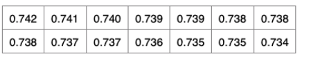

最终b榜的分数是我们对14个基模型进行多轮投票融合获得的结果。14个基模型是在6种模型结构的基础上通过使用不同的数据处理方式以及不同的参数获得的。


# 二、A榜第一B榜第二方案

来自 <https://zhuanlan.zhihu.com/p/149936466> 

![科 技 《 惻 处 大 数 据 公 益 钱 赛  2020  北 京 数 丌 放  创 新 应 用 大 赛  Percentäfik  调 参 了 五 种 基 于 向 量 的 洙 度 楱 型  向 量 楱 型 内 部 集 成  向 量 模 型 和 bert 模 型 集 成  在 rt 模 型 后 加 注 力 机 制 的 RN &  在 模 型 训 练 过 程 中 采 用 对 抗 样 本 训 练 使 得 模 型 的 泛 化 能 力 得 到 提 高  对 学 习 率 、 № 忆 、 epoch 、 5 p 等 超 参 讲 行 调 优  模 型 集 成  整 体 技 术 路 线  技 术 路 线  对 抗 训 练 与 调 优  数 据 探 索  多 模 态 合  机 器 学 习 技 巧  图 形 特 征 、 文 本 挖 掘 特 征 、 时 间 特 鉦 、 视 頻 特 征 分 析  数 据 增 广 ： 同 义 词 替 换 、 陌 机 拖 入 、 机 交 換 、 机 鷹 除 、 回 译  腾 讯 谒 向 馕 相 似 词 扩 充  将 图 像 持 征 和 bert 模 型 做 Sta ng  单 独 训 练 图 像 和 视 頻 分 类 楱 型 浏 试 可 行 性  半 坠 督 学 习 及 伪 标 签 法  fl 指 标 优 化 方 法  对 berte 型 进 行 post-train  生 刂 乎 @l\]ecther ](readme.assets/clip_image001.jpg)

## 1.数据探索

1. 数据清洗

首先我们经过统计分析发现诸如“转发微博”、“网页链接”和“展开全文”这些关键字与预测结果没有相关性，实验结果说明，应该直接用空字符串替换；其次是发现微博内容中有诸如回复**和@**这样的结构，后面的**表示人名，而人名往往很长，这些无意义的字会对语义产生干扰，我们统一将这两个结构用@这一个字符进行替换；另外，我们还对文字进行了繁简替换处理以及删除重复数据条目处理。

 

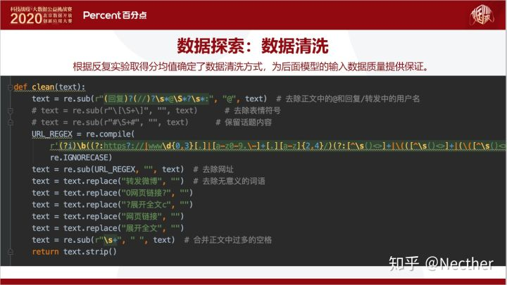

 

2. 数据增强数据增强我们尝试了两种方式，第一种是同义词替换、随机插入、随机交换、随机删除结合的方式，代码参考（https://github.com/zhanlaoban/EDA_NLP_for_Chinese）；第二种是回译法，即将训练集中的文本数据通过百度翻译API翻译成英文和日文后，再翻译成中文，得到新数据集后对原有训练集做数据扩充。

在数据探索的实验中，我们将原训练集划分成了训练集、测试集和验证集，下表是数据增强的实验结果，发现效果并不理想。

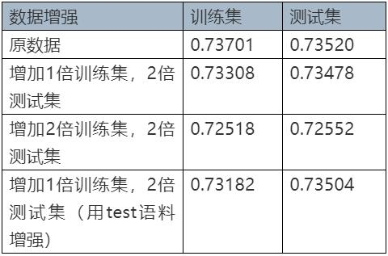

 

![科 技 战 疫 ， 大 数 据 公 益 钱 赛  2020  北 京 数 开 放  创 新 应 用 大 赛  Percentäfik  数 据 探 索 ： 数 据 扩 充  随 机 交 换 、 随 机 删 除 、 随 机 交 换 、 同 义 替 换 (https://github ℃ om/huyingxi/Synonyms) 得 分 均 没 有 提 升  batch size seq_len Ir  关 00 数  warm_up epoch  @ba起取关譴i司 ． 匹 配 绪 词 库 关 i 司 ． 取 前 20  住 1 的 厩 机 （ 机 交 、 随 和 除 、 随 机 交 涣 、 同 义 g 〕 trainlr 充 一倍， te 无 旷 充 全 Bshuffe  住 1 的 概 率 随 机 选 （ 随 机 交 ， 随 机 鷹 随 机 交 ． 同 义 替 换 〕 t 囿 n 扩 充 2 倍 。 testif 充 5倍 4Bshuffle  base bert chinese  base bert chinese  base bert chinese  回 译 方 法  240  240  240  59 ． 50e ． 5  5e ． 5 ． le ． 5  5 小 50e 巧  比 赛 结 製 模 型 路 径  step  07169  0 ． 687g  0 ． 68765  先 将 中 文 文 本 翻 译 为 英 文 和 日 文  然 后 翻 译 回 来 得 到 扩 充 数 据 集 再 训 练 得 分 并 不 理 想  经 人 为 观 察 ， 翻 译 之 后 的 数 据 质 量 较 差  （ 同 音 字 、 意 刽 司 语 、 错 字 、 符 号 较 多 ， 翻 译 效 果 不 好 ）  知 乎 @l\]ecther ](readme.assets/clip_image004.jpg)

 

 

## 2.多模态融合

在多模态融合方面，我们尝试了densenet121图像特征提取器，发现该方法和基于bert base的stacking模型进行对比，并无提升。我们经过一系列的分析，发现图片特征起不到预测的提升效果，所以我们舍弃了多模态方法。

## 3.样本不平衡

我们采用focal loss技术对数据样本不平衡进行处理，发现相比bert base的结果略微有下降。

 

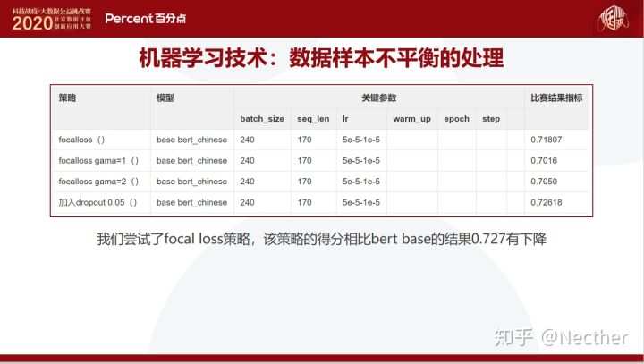

## 4.半监督学习

我们还尝试了半监督学习的方法，利用90万未标记数据尝试伪标签法，发现效果提升并不明显。

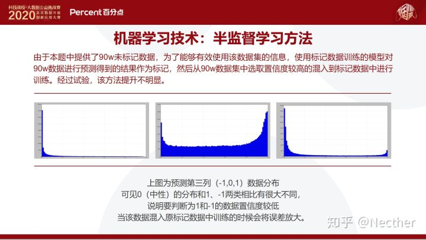

## 5.Post-train

接下来，重点介绍一下我们在本次比赛当中使用的post train方法，它的主要思想是结合领域数据，对bert base模型进行微调，学习该领域知识，改进bert base模型与特定领域的匹配程度，因为bert base模型是通过维基百科语料训练的，所以它缺乏特定领域的知识，例如本次比赛中的微博数据知识。经过实验，Post-train是比较有效果的，相比bert base模型，大约有0.8个百分点的F1值提升。

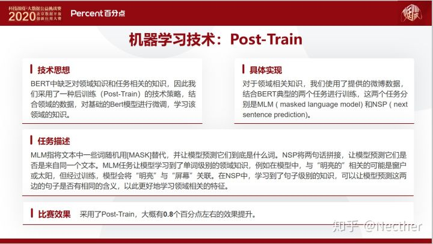

## 6.对抗训练

为了提升模型的预测稳定性，我们还采用了对抗训练的技术。它的主要思想是提升模型在小扰动下的稳定性，比如上面图中的每一个点代表一个数据样本，它在通过对抗训练之后，可以明显看到每一个数据点都落在一个小的坑里面，这样它的模型泛化能力就被增强了，通过我们的实验，效果大约能够提升0.5个百分点。（此处参考苏剑林的博客）

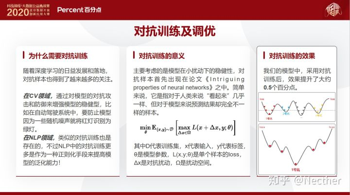

 

## 7.F1值适应优化以及多折模型融合

另外，我们还采用了F1值适应优化以及多折模型融合的技术，这两个技术都有明显的效果提升。F1值适应技术的主要思想是准确度最高的模型，它的F1值并非最大，所以我们**在输出结果的时候，前面乘一个权重，然后通过非线性优化的方法使得F1值最大（**https://www.jianshu.com/p/51debab91824**）**。在模型融合方面，经过实验，5到7折能够取得最好的效果。

## 8.词向量模型

我们另外还尝试了集成词向量模型，发现效果不好。

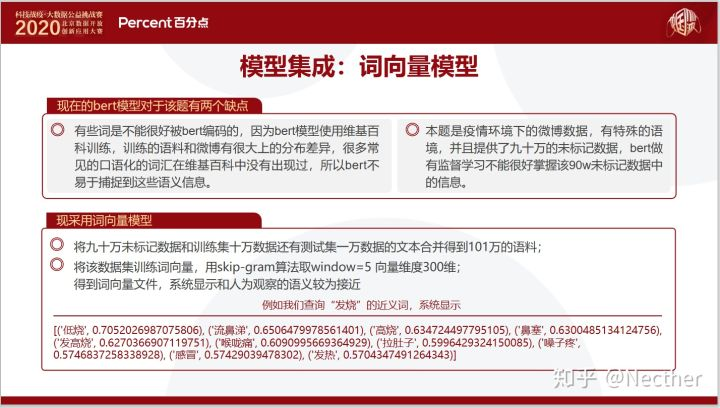

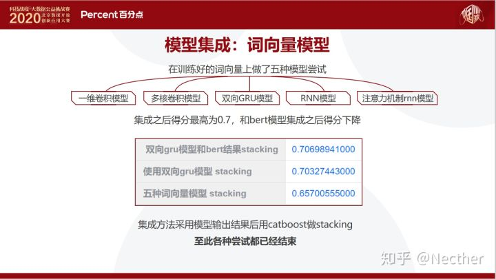

 

## 9.模型集成

通过各种技术的尝试和实验，我们最终的算法方案是Post-Training、对抗训练、F1适应优化和模型集成等多种技术的融合，取得了A榜第一、B榜第二的良好成绩，整体方案的流程图如下图所示，该方案在执行效率方面，算法离线模型训练只需要40分钟，实时预测速度为0.1秒，执行效率高，实用性强。

 

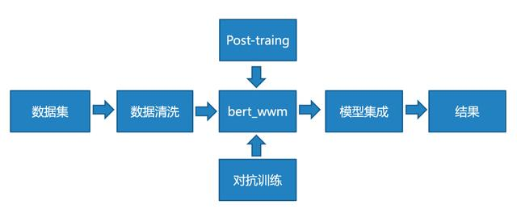

 

 

 

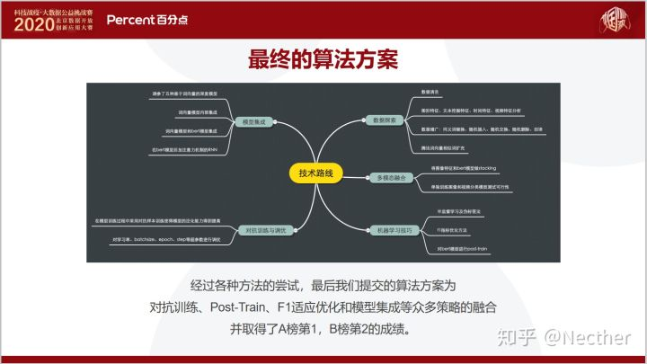

 

# 三、A榜第三B榜第三方案

https://discussion.datafountain.cn/questions/2628

## 1.数据处理

（1）无监督数据

因为经过去噪的无监督数据集99.9%的文本长度都在256以内，所以我们通过ROBERTA[1]预训练的方式，在ROBERTA-base模型的基础上，利用16G显存GPU对从90w

数据得到的最大长度为256的语料进行再次预训练，将其作为新的预训练模型，并用于后期构建异构单模。

（2）有监督数据

因为训练集和测试集的文本经过去噪处理之后，得到的数据都在200以内，基于微博内容最大长度为140的原则，我们将Max Len设置成150，覆盖了绝大多数微博的内容，且短文本也加快了训练与推断的速度。

## 2.模型方法

笔者尝试使用得到的预训练模型与Roberta预训练模型，分别下接BiGRU与BILSTM三种结构来构建文本匹配模型。最后，我们采用异构单模的结果投票进行多模融合。

1. BERT-BiGRU与BERT-BiLSTM

BERT预训练模型学习到的token向量输入这两种模型结构进行进一步学习，让模型更好的理解文本的上下关系，最终通过average pooling层并softmax输出分类结构。它们在增加异构单模多样性的同时，性能相比3.1节介绍的模型稍强，模型结构如图3所示。

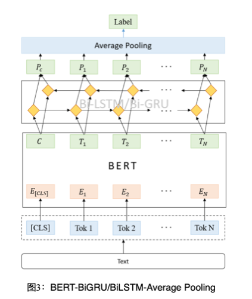

 

 

2. BERT多层表示的动态权重融合

Ganesh Jawahar等人[2]通过实验验证了BERT[3]每一层对文本的理解都有所不同。为此，我们对BERT进行了改写，将BERT的十二层transformer生成的表示赋予一个权重,权重的初始化如公式(1）所示，而后通过训练来确定权重值，并将每一层生成的表示加权平均，再通过一层全连接层降维至512维如公式(2）所示，最后结合之前的Bi-GRU和Bi-LSTM模型来获得多种异构单模。BERT多层表示的动态权重融合结构如图4所示。其中represent,为BERT每一层输出的表示，αi为权重BERT每一层表示的权重值。

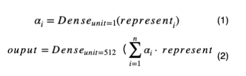

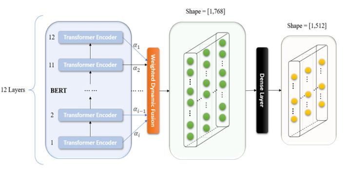

 

最后，笔者通过实验发现，BERT的动态融合作为模型embedding的成绩会优于BERT最后一层向量作为模型的mbedding。因此，本次比赛笔者使用的异构单模均是使用BERT的动态融合向量作为模型的embedding。

 

3. HireBert模型结构

我们团队后期还采用了上海交大提出的HireBert模型[4]。我们在Bert的12层的transformer_encoder的输出旁边放置了2层双向GRU，每一层的输出进过双向GRU后输入至unit为1的全连接层，用来学习每一层向量的权重。对每一层的权重与输出的向量加权相加，得到Hire的隐藏信息。融合层通过两个不同的功能步骤将HIRE提取的隐藏信息与Transformer最终层的输出进行整合，形成一种精细的语境化语言表示。其中，整合方式如公式(3）所示，模型结构如图5所示。

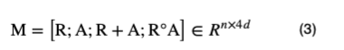

其中o是Hadamard积（对应位置相乘)，[]是最后一维度的拼接。R为bert最后一层结构，A为提取出来的每一层的输出乘以训练的权重相加成一个[batchsize,seq_len,max_len]。其中每一层的权重由两个参数共享的双向GRU决定。得到的语境化表示的向量再接2层双向GRU筛选重要信息，接unit=3的全连接层进行3分类。

 

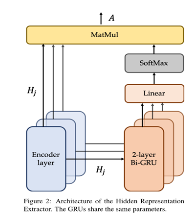

 

## 3.多分类F1阈值搜索

我们通过训练集数据进行统计发现，标签-1:O:+1的比例为3:12:5，存在样本不均衡情况，我们通过多分类F1搜索，将得到的模型对验证集进行预测，并将预测值与真实值进行阈值搜索，找出一个权重，用于测试集的预测。最终的结果对比如下表:

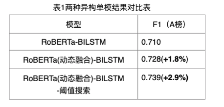

 

## 4.模型融合

通过前几节的介绍，我们得到了多种类别的异构模型，并通过投票的方式进行融合。

 


# 四、Rank20

文章来源：https://cloud.tencent.com/developer/article/1633993

代码链接：https://github.com/ZhiWenMo/ncov_sentiment_classification

## 1.基本模型

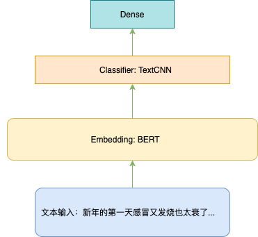

``

```javascript
class SentimentClfModel(tf.keras.Model):
    def __init__(self, config, **kwargs):
        super(SentimentClfModel, self).__init__(**kwargs)
        self.config = config
        self.bert_model_config = transformers.BertConfig. \
            from_pretrained(self.config.bert_path+'bert-base-chinese-config.json')
        self.bert_model = transformers.TFBertModel. \
            from_pretrained(self.config.bert_path+'bert-base-chinese-tf_model.h5',
                            config=self.bert_model_config)

        self.textcnn = TextCNN(kernel_sizes=self.config.kernel_size, filter_size=self.config.filter_size,
                               activation=self.config.activation, dropout_rate=self.config.dropout_rate)

        self.linear = Dense(len(self.config.kernel_size) * self.config.filter_size, activation=self.config.activation)
        self.layer_norm = LayerNormalization(axis=-1, center=True, scale=True)
        self.dropout = Dropout(self.config.dropout_rate)
        self.out = Dense(len(self.config.labels), activation='softmax')


    def call(self, inputs):
        input_ids, input_mask, token_type_ids = inputs
        embedding, _ = self.bert_model(input_ids, attention_mask=input_mask, token_type_ids=token_type_ids)
        textcnn_out = self.textcnn(embedding)
        linear_out = self.linear(textcnn_out)
        add_norm = self.layer_norm(add([textcnn_out, linear_out]))
        add_norm = self.dropout(add_norm)
        output = self.out(add_norm)

        return output

    def compute_output_shape(self, input_shape):
        return (None, len(self.config.labels))
```

 

## 2.Trick 1 - F1 指标优化

**端到端的优化 F1-loss**

因为 F1 不可导，所以无法用作损失函数，那我们是否可以光滑化 F1 函数去逼近真正的 F1 呢？是可以的，感兴趣的同学可以读一读苏老师的这篇文章 **函数光滑化杂谈：不可导函数的可导逼近****（***https://spaces.ac.cn/archives/6620#how_to_cite***）**。

``

```python
from functools import partial
import numpy as np
import scipy as sp
from sklearn.metrics import f1_score
class OptimizedF1(object):
    def __init__(self):
        self.coef_ = []

    def _kappa_loss(self, coef, X, y):
        """
        y_hat = argmax(coef*X, axis=-1)
        :param coef: (1D array) weights
        :param X: (2D array)logits
        :param y: (1D array) label
        :return: -f1
        """
        X_p = np.copy(X)
        X_p = coef*X_p
        ll = f1_score(y, np.argmax(X_p, axis=-1), average='macro')
        return -ll

    def fit(self, X, y):
        loss_partial = partial(self._kappa_loss, X=X, y=y)
        initial_coef = [1. for _ in range(len(set(y)))]
        self.coef_ = sp.optimize.minimize(loss_partial, initial_coef, method='nelder-mead')

    def predict(self, X, y):
        X_p = np.copy(X)
        X_p = self.coef_['x'] * X_p
        return f1_score(y, np.argmax(X_p, axis=-1), average='macro')

    def coefficients(self):
        return self.coef_['x']
```

 

## 3.Trick 2 - 伪标签

这个 trick 其实也很简单，就是最后把你做的最好的模型，用来预测测试数据，然后再用这些数据和你原本的数据混在一起训练模型。注意必须保证训练的时候你制造伪标签的数据必须在训练集里面。这部分操作完整代码会有体现。

**训练流程**

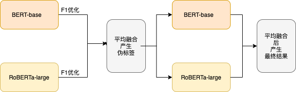

- 训练 BERT-base 和 RoBERTa-large 得到后分别进行 F1     指标优化
- 利用优化后的概率取平均输出伪标签
- 使用伪标签 + 原有训练数据再训练以上两个模型再取结果的平均值。